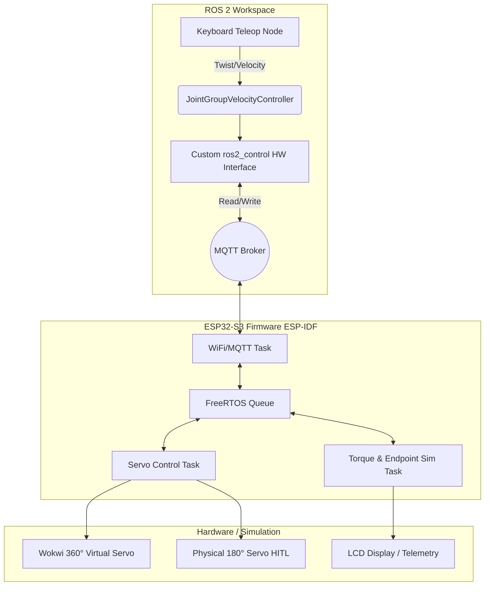

# PIKES Smart Servo Control System

This repository contains the firmware and ROS 2 integration for an smart servo system, developed for the PIKES GmbH. 

The project bridges a high-level ROS 2 environment with a low-level ESP32-S3 microcontroller via a custom `ros2_control` hardware interface. It features both a virtual 360-degree continuous rotation simulation and a physical Hardware-in-the-Loop (HITL) validation using an ESP32-S3 and a 180-degree servo.

## 🏗️ System Architecture
The system utilizes an MQTT gateway to seamlessly pass velocity commands and telemetry between the ROS 2 lifecycle nodes and the embedded FreeRTOS environment.



## 🚀 Development Roadmap & Iterative Approach
This system is built iteratively, starting with low-level hardware validation and scaling up to complex, multi-threaded robotic integrations.

### Phase 1: Hardware Bring-up & Unit Testing
* [x] Initialized PlatformIO environment with the ESP-IDF framework.
* [x] Implemented basic PWM drivers for the ESP32-S3 to sweep a physical 180° servo.
* [x] Developed modular unit tests to validate servo positioning, duty cycle calculations, and GPIO configurations.

### Phase 2: RTOS Integration & Code Optimization
* [ ] Transitioned bare-metal loops to a FreeRTOS architecture.
* [ ] Created dedicated, thread-safe tasks for servo actuation and sensor processing to ensure deterministic performance.
* [x] Implemented a 40:15 gear ratio mathematical model in the control task to map motor shaft angles to the virtual door position.

### Phase 3: The Communication Bridge
* [ ] Integrated `esp-mqtt` to establish a robust connection to a local MQTT broker.
* [ ] Defined JSON payload structures for incoming velocity commands and outgoing telemetry (position, simulated torque).
* [ ] Implemented error handling and auto-reconnection logic for the WiFi and MQTT state machines.

### Phase 4: ROS 2 Orchestration

* [ ] Developed a custom `SystemInterface` in C++ for `ros2_control` to treat MQTT topics as hardware registers.
* [ ] Created a `teleop_keyboard` node to capture arrow keys (rotation) and +/- keys (velocity adjustment).
* [ ] Streamed data bi-directionally.

### Phase 5: Endpoint Detection & Simulated Dynamics

* [ ] Extended firmware to generate randomized hardware endpoints (within a 60° range).
* [ ] Implemented a mathematical torque simulation function ($T_{sim}$) that spikes when positional limits are breached.
* [ ] Built an automated calibration state machine that detects endpoints based on the simulated torque thresholds and restricts operational movement accordingly.

### Phase 6: Advanced Visualization & Professional Logging

* [x] Integrated comprehensive ESP-IDF logging macros (`ESP_LOGI`, `ESP_LOGW`) throughout the firmware.
* [ ] Added live plotting capabilities using Foxglove Studio / `rqt_plot` to visualize the relationship between commanded velocity, servo position, and simulated torque spikes in real-time.

---

## 🛠️ Hardware Requirements

* **Microcontroller:** ESP32-S3 (Development Board)
* **Actuator (Physical):** Standard 180° Servo Motor (for HITL testing)
* **Actuator (Virtual):** Wokwi simulated continuous rotation servo
* **Network:** 2.4GHz WiFi connection and an MQTT Broker (e.g., Mosquitto)

## 💻 Deployment and Running Instructions

### 1. Embedded Firmware Setup (PlatformIO)

1. Clone this repository and open the `firmware` folder in VS Code with the PlatformIO extension installed.
2. Configure your WiFi credentials and MQTT Broker IP in `src/config.h` (or via `menuconfig`).
3. Connect your ESP32-S3 via USB.
4. Build and flash the firmware:
```bash
pio run --target upload
pio device monitor

```

### 2. VS Code & clangd Setup

If you are using the **clangd** extension for C/C++ IntelliSense instead of the default Microsoft extension, you need to generate a compilation database so it can accurately locate the ESP-IDF framework headers.

1. Disable the default IntelliSense engine in your `.vscode/settings.json`:

```json
"C_Cpp.intelliSenseEngine": "disabled"

```

2. Open the **PlatformIO Core CLI** (using the terminal icon in the bottom toolbar) and generate the database:

```bash
pio run -t compiledb

```

3. Point `clangd` to the newly generated database in your `.vscode/settings.json` (replace `<your_env>` with your target environment from `platformio.ini`):

```json
"clangd.arguments": [
    "--compile-commands-dir=.pio/build/<your_env>"
]

```

4. Restart the `clangd` language server via the VS Code Command Palette. *(Note: Re-run the `compiledb` command whenever you add new libraries).*

### 3. ROS 2 Workspace Setup

*(A Dockerized environment is recommended for seamless deployment).*

1. Navigate to the `ros2_ws` directory.
2. Build the Docker container (which includes the custom `ros2_control` interface and MQTT dependencies):
```bash
docker build -t pikes_servo_ros2 .

```


3. Launch the system using Docker Compose:
```bash
docker-compose up

```


4. To control the servo, open a new terminal into the running container and start the keyboard node:
```bash
docker exec -it pikes_ros2_container bash
ros2 run servo_teleop keyboard_control

```

### 4. Running Unit Tests

This project uses PlatformIO's built-in Unity testing framework for Hardware-in-the-Loop (HITL) and software logic validation.

### Available Test Suites

* **`test_servo`**: Validates the LEDC PWM driver initialization and executes a physical hardware sweep (10° → 90° → 180° → 10°) tuned for the HiTEC HS-311 servo.
* **`test_uart_logs`**: Verifies that standard ESP-IDF logging macros (`ESP_LOGI`, `ESP_LOGW`, `ESP_LOGE`) are correctly routed through the ESP32-S3 Native USB Serial/JTAG Controller.

### Test Execution Commands

To execute all test suites sequentially, use the PlatformIO Core CLI:

```bash
pio test

```

To isolate and run a specific test suite on a specific environment (e.g., just the servo hardware test), use the environment (`-e`) and folder filter (`-f`) flags:

```bash
pio test -e esp32-s3-devkitc-1 -f test_servo

```

**Tip:** If you want to see the complete log output (including your custom `ESP_LOGI` statements) rather than just the Pass/Fail summary, append the verbose flag (`-v`) to your command:

```bash
pio test -e esp32-s3-devkitc-1 -f test_servo -v

```

## 🎥 Demonstration Video

*(Link to a short video demonstrating Task #1 and Task #2 will be provided here, showcasing the split-screen view of the ROS 2 terminal and the moving servo).*

