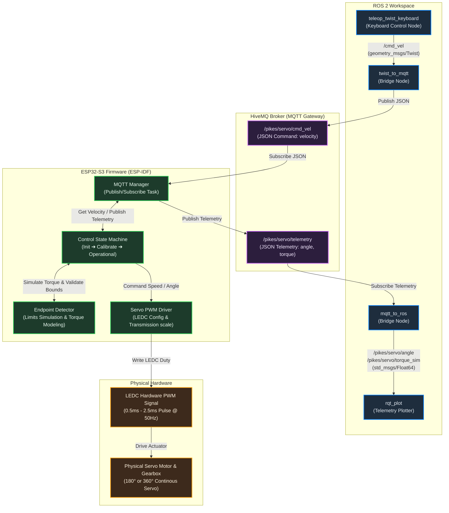

# PIKES Smart Servo System Workspace
This repository contains the solution developed to the evaluation task, as outlined in, as outlined in [this PDF](docs/ESP_Task_for_2nd_Round.pdf).

This repository is organized into distinct subdirectories:
1.  **[firmware/](firmware):** ESP32-S3 PlatformIO project (using ESP-IDF) implementing low-level PWM drivers, torque-based automatic calibration, and MQTT topics mapping.
2.  **[ros2_ws/](ros2_ws):** ROS 2 Control package workspace containing the MQTT driver interface, keyboard teleoperation nodes.
3.  **[docs/](docs):** Project assets and documentation sheets.

---

## Demonstration Videos
> [!IMPORTANT]
> To quickly evaluate the functionality of this solution, watch the recorded videos below demonstrating the features required for Task 1 and Task 2:
*   **Task 1 - Setup and MQTT Teleoperation Demonstration:**
    Shows the ESP32-S3 sweeping a standard servo on startup and responding to keyboard inputs from the ROS 2 teleop terminal via the MQTT broker.
    [Watch Task 1 Demo Video](docs/Task_1_Setup_and_Teleop.mp4)

*   **Task 2 - Automatic Calibration and Limit Enforcement Demonstration:**
    Shows the startup calibration sequence where the servo sweeps the door to detect limits via simulated torque spikes, followed by operational control being restricted within those boundaries.
    [Watch Task 2 Demo Video](docs/Task_2_Torque_Calibration.mp4)

---

## System Architecture

The following diagram illustrates the bi-directional flow of commands and telemetry across the entire smart servo control system:

---

## Project Directory Structure and Links
Click on the links below to view details and readmes for each workspace component:

### ESP32-S3 Firmware (firmware/)
Contains all the embedded C source code, configuration files, and unit tests:
*   **Detailed Firmware Guide:** [firmware/README.md](firmware/README.md)
*   **Main Entrypoint Code:** [firmware/src/main.c](firmware/src/main.c)
*   **Unity Unit Testing Guide:** [firmware/test/README.md](firmware/test/README.md)
*   **PlatformIO Project Config:** [firmware/platformio.ini](firmware/platformio.ini)

### ROS 2 Control Workspace (ros2_ws/)
Contains the high-level ROS 2 nodes and communication files:
*   **ROS 2 Guide and Setup:** [ros2_ws/README.md](ros2_ws/README.md)

### Specifications and Documents (docs/)
Contains specifications and references for the project tasks:
*   **Task Requirement Sheet (PDF):** [docs/ESP_Task_for_2nd_Round.pdf](docs/ESP_Task_for_2nd_Round.pdf)

---

## Step by Step Guide
To run and evaluate the system, follow this general sequential order:

1.  **Step 1: Check Task Details:** Understand the project requirements in the task description document ([docs/ESP_Task_for_2nd_Round.pdf](docs/ESP_Task_for_2nd_Round.pdf)).
2.  **Step 2: Flash the Firmware:** Configure your Wi-Fi details, connect the ESP32-S3, and flash the program using the guide in [firmware/README.md](firmware/README.md).
3.  **Step 3: Execute Unit Tests:** Run modular unit tests to verify the driver and endpoint safety algorithms using [firmware/test/README.md](firmware/test/README.md).
4.  **Step 4: Run the ROS 2 Environment:** Launch the MQTT broker and key-press teleop nodes following the steps in [ros2_ws/README.md](ros2_ws/README.md).